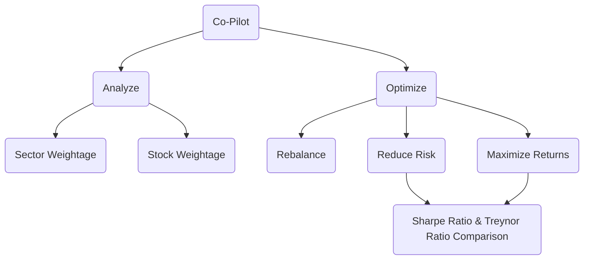

# Portfolio Analyzer

```mermaid
graph TD;
    A(Co-Pilot) --> B(Analyze) & C(Optimize)
    B --> D(Sector Weightage) & E(Stock Weightage)
    C --> F(Rebalance) & G(Reduce Risk) & H(Maximize Returns)
    G & H --> I(Sharpe Ratio & Treynor Ratio Comparison)
```
