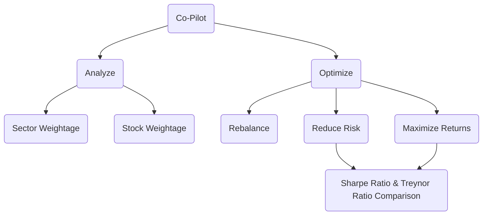

# Finance-Tools 📊

A collection of financial analysis tools to help investors make data-driven decisions.

[](https://finance-tools.streamlit.app/)
[](https://opensource.org/licenses/MIT)
[](https://github.com/sponsors/hirawatt)
[](https://www.python.org/downloads/)
[](https://github.com/hirawatt/finance-tools)

## 🌟 Featured Tools

### 1. Zerodha Leaderboards

Track top performers using [Verified PnL](https://support.zerodha.com/category/console/reports/other-queries/articles/verified-p-l)
📈 **Live Demo**: [zerodha.hirawat.in](https://zerodha.hirawat.in/)

### 2. Co-Pilot: Portfolio Analyzer

An intelligent portfolio management system that provides comprehensive analysis and optimization suggestions for your investments.

#### Key Features

- 📊 Portfolio Analysis
- 🎯 Risk Assessment
- 📈 Performance Tracking
- 🔄 Rebalancing Suggestions
- 📉 Risk Management

## 🚀 Getting Started

```bash
# Clone the repository
git clone https://github.com/hirawatt/finance-tools.git

# Install dependencies
pip install -r requirements.txt

# Run the Streamlit app
streamlit run app.py
```

## 🗺️ Roadmap

### Portfolio Analyzer

- [ ] Integration with [quantstats](https://github.com/ranaroussi/quantstats)
- [ ] Advanced Portfolio Analytics
  - [ ] Sector & Stock Weightage
  - [ ] Portfolio Beta Calculation
  - [ ] PE Ratio Analysis
  - [ ] Correlation Matrix
- [ ] Risk Management
  - [ ] ASM/GSM List Monitoring
  - [ ] Default Probability Assessment
  - [ ] Automated Rebalancing Suggestions
- [ ] Market Intelligence
  - [ ] Earnings Calendar
  - [ ] Price Forecasting
  - [ ] Red Flag Detection 🚩

## 📊 Portfolio Analysis Flow



## 🤝 Contributing

Contributions are welcome! Please feel free to submit a Pull Request.

## 💝 Support the Project

If you find this project useful, consider supporting its development:

- [GitHub Sponsors](https://github.com/sponsors/hirawatt)
- <a href="https://www.buymeacoffee.com/hirawat" target="_blank"></a>

## 📝 License

This project is licensed under the MIT License - see the [LICENSE](LICENSE) file for details.
