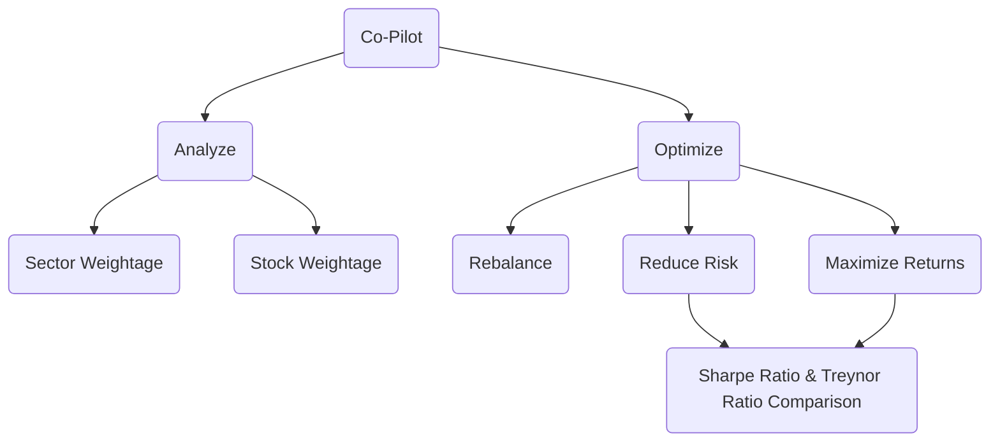

# Finance-Tools

## New Tool - Zerodha [Leaderboards](https://zerodha.hirawat.in/) - using [Verified PnL](https://support.zerodha.com/category/console/reports/other-queries/articles/verified-p-l)

## Co-Pilot : Portfolio Analyzer

The Portfolio Analyzer is a data-driven, financial application that helps investors make better decisions. The application will allow you to analyze all of your investments, stocks, bonds, mutual funds, and other financial instruments in one place. It is a great tool for managing your investments and tracking your portfolio performance. The Portfolio Analyzer is perfect for those who want to make informed decisions about their investments and who want to track their progress over time.

> Above description generated using - [this](https://mydukaan.io/tools/product-description-generator)

## Idea Generation

## Due Diligence

---

## Roadmap

> Co-Pilot : Portfolio Analyzer

- [ ] Try -> [quantstats](https://github.com/ranaroussi/quantstats) library
- [ ] Sector Weightage
- [ ] Stock Weightage
- [ ] Earnings Calander
- [ ] Correlation
- [ ] Rebalancing for stocks above 30% weightage
- [ ] Portfolio Beta Calculation
- [ ] PE Ratio
- [ ] Price Forecast
- [ ] Potential Red Flags 🚩
  - ASM/GSM List
  - High Default Probability

---

## GUIDE - How To Use

> Portfolio Analyzer

